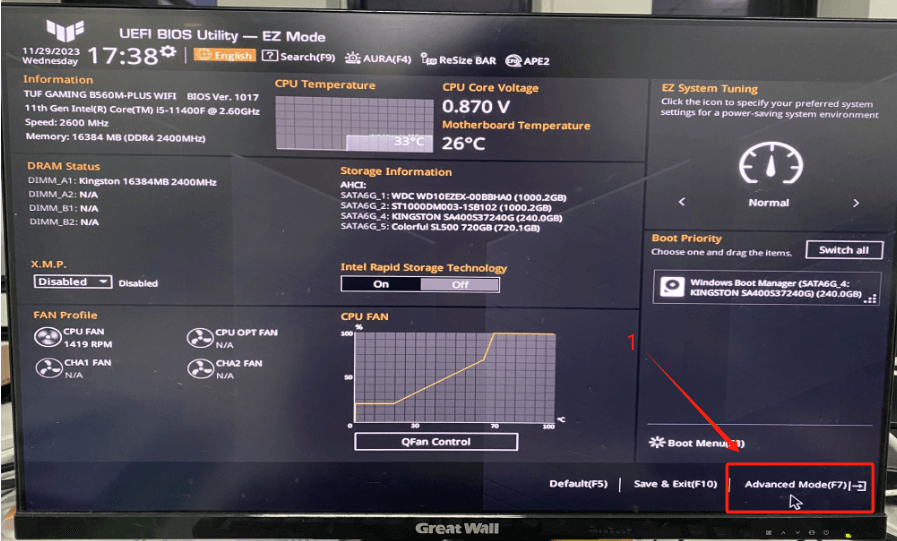
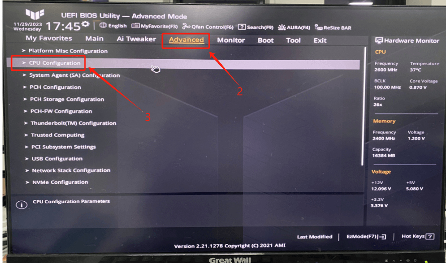
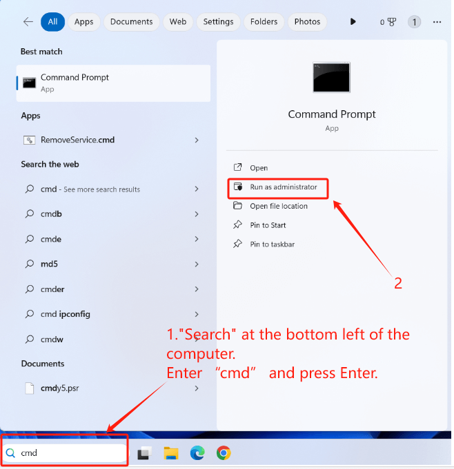
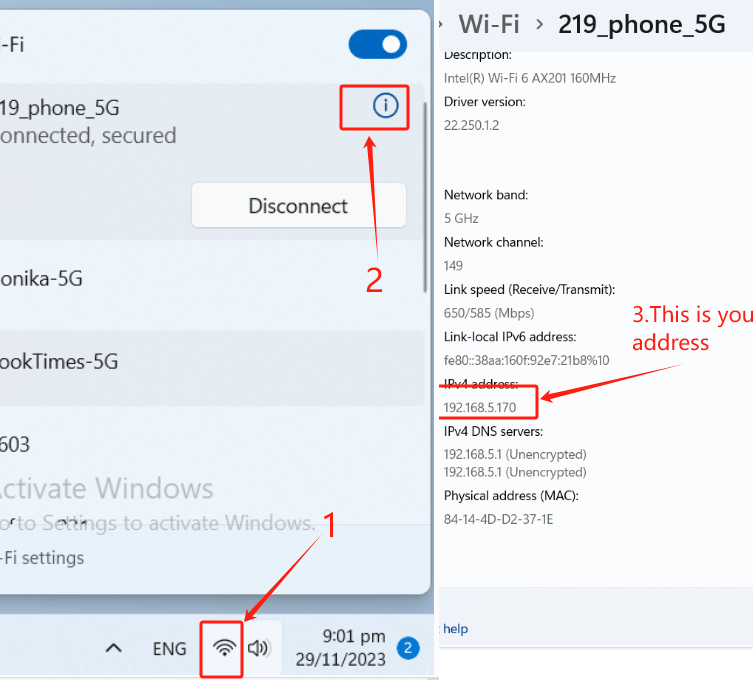

# Windows

## Install docker
1. The local motherboard virtualization options need to be adjusted<br>
  First restart the computer, and keep pressing the three keys "F1" and "F2" and "DEL" when restarting the computer to enter the Bios (because most motherboards are one of these three keys, so press together, and note that the laptop is to press the "ESC" key)<br>
  
  
  


2. You can use https://learn.microsoft.com/en-us/windows/wsl/install or for installation WSL in Microsoft store
  Or install it through the administrator command line as shown below:
  

- Go to the command window and run the following command
```
  WSL --install
```


- If the following prompts appear<br>
 
- solution
```
 Run: wsl --list --online to see which versions can be installed
 Then run: wsl --install -d Ubuntu-20.04 # where Ubuntu-20.04 is the version number
```
3. Open the administrator command line and log in to WSL
4. Run the command ```wsl``` or ```wsl -u [username]``` username is the username you installed earlier
5. After logging in, we started to install docker (each action is run one command in turn, the same below).
```
   sudo apt update
   sudo apt install apt-transport-https ca-certificates curl software-properties-common
   curl -fsSL https://download.docker.com/linux/ubuntu/gpg | sudo apt-key add -
   sudo add-apt-repository "deb [arch=amd64] https://download.docker.com/linux/ubuntu $(lsb_release -cs) stable"
   sudo apt update
   sudo apt install docker-ce
   sudo service docker start
   sudo service docker status
```
6. After installing docker, grant permissions to the current logged-in user
```sudo usermod -aG docker $USER```
7. Start the docker command```sudo service docker start```
8. If ```service docker status``` is "active (running)" or "Docker is running", it is normal
9. If indicated```Docker is not running```
- Solution, run the command
```
sudo update-alternatives --set iptables /usr/sbin/iptables-legacy
sudo update-alternatives --set ip6tables /usr/sbin/ip6tables-legacy
```
10. Install docker-compose
```
sudo apt-get install docker-compose
sudo rm /usr/local/bin/docker-compose
sudo ln -s /usr/bin/docker-compose /usr/local/bin/docker-compose
```
11. Install network management Run: ```sudo apt install net-tools```
12. Once docker is installed, you don't need to install it again
## Configuration Holmes
13. Run the command ```service docker status``` to confirm that docker is running "active (running)" <br>
14. Obtain the local Intranet IP address and record it, usually 192.168.1.xxx,you can use it later in the installation path As  shown below:<br>


15.Then, there are two ways to install Holmes. Choose one of the following

- （1）Download the package directly (recommended)
- Run the command ```pwd``` from the WSL command line and you will see your current folder address such as ```/mnt/c/Windows/system32```
- Click”<a href="https://github.com/DeepThought-AI/Holmes" target='_blank'>here</a>“Download our code via the web page. As illustrated in following figure
- 
- The extracted folder "Holmes" is moved to C:/Windows/system32 (That is, the folder address seen above,c represents C disk)
- Go back to the WSL command line and run the command ```cd Holmes ``` to enter the project folder
- Change permission ```sudo chmod +x ./Install.sh```
- Run the command ```sudo ./Install_cn.sh ``` to start the installation.After the installation, there will be a URL prompt, which can be accessed directly by the browser

- （2）Download the code by command (local github public key required)
- Download our code，```git clone git@github.com:DeepThought-AI/Holmes.git```
- Appear ```Are you sure you want to continue connecting (yes/no/[fingerprint])? ```
- Enter ```yes``` and press Enter
- Go to project folder ```cd Holmes ```
- Change permission ```sudo chmod +x ./Install.sh```
- Run the command ```sudo ./Install_cn.sh ``` to start the installation<br>
16. After the installation, there will be a URL prompt, which can be accessed directly by the browser<br>
（Note * Closing the command window will not allow you to access urls belonging to Holmes
   Using Holmes again, open the “Command Prompt” window "Run as administrator"
  ```
   1.Run the “wsl” command
   2.Run the “cd Holmes” command
   3.Run the "sudo docker-compose start" command
  ```
   You can go to the browser to open your own Holmes URL [URL is http:// 'Intranet IP address of this machine' :8338]


# Ubuntu
## Install docker
1. On the system, go to the CLI and run the following commands step by step (if docker is installed, skip the first two steps)：
```
sudo apt-get clean
sudo apt-get update
sudo apt-get install ca-certificates curl gnupg lsb-release
sudo curl -fsSL http://mirrors.aliyun.com/docker-ce/linux/ubuntu/gpg | sudo apt-key add -
sudo add-apt-repository "deb [arch=amd64] http://mirrors.aliyun.com/docker-ce/linux/ubuntu $(lsb_release -cs) stable"
sudo apt-get update
apt-get install docker-ce docker-ce-cli containerd.io
sudo usermod -aG docker $USER
```
2. You need to log out of the current account and log in again. After re-logging in, go to the CLI
```
systemctl start docker
sud apt-get -y install apt-transport-https ca-certificates curl software-properties-common
sudo systemctl enable docker
```
## Configuration Holmes
3. Start downloading our code file
```
git clone git@github.com:DeepThought-AI/Holmes.git
```
4. Unzip it, rename it to "Holmes" and go to the directory
```
 cd Holmes && sudo chmod+x./Install.sh
 . Install_cn.sh
```
5. Note that the preceding command runs  . Install_cn.sh
6. After the installation, there will be a URL prompt, which can be accessed directly by the browser


# Mac
## Install docker
### 1. Download docker desktop (recommended)
- From here：https://docs.docker.com/desktop/install/mac-install/
  - Open docker desktop, click "setting" and select Docker engine
  ```
  {
    "builder": {
      "gc": {
        "defaultKeepStorage": "20GB",
        "enabled": true
      }
    },
    "experimental": false,
    "registry-mirrors": [
      "https://docker.mirrors.ustc.edu.cn" # 新增国内源，建议用阿里云自定义源
    ]
  }
  ```
### 2.Install docker using system preferences
- Installation command：```brew install docker```
- Run command：```brew services start docker```
- Check command：```brew services list |grep docker```

## Configuration Holmes
- Download code```git clone git@github.com:DeepThought-AI/Holmes.git```
- Run command ```cd Holmes ```
- Change permission ```sudo chmod+x ./Install.sh```
- Run the command ```sudo ./Install_cn.sh ``` to start the installation. After the installation, there will be a URL prompt, which can be accessed directly by the browser

