<h1 align="center">Holmes User Manual</h1>

Languages： [中文](../cn/user_manual_cn.md) English

<h2 align="left">1，Configure API KEY</h2>

- [Setting]-[API KEY]

### 1.1, About OPENAI API KEY:

- Requires access to gpt4 models.
- Other large models will be supported in the future, so stay tuned.

### 1.2, About the proxy:

- OPENAI API access may require proxy configuration, please configure the proxy yourself.

- After the KEY and proxy are configured, click [Connection Test] and "Test success" will be displayed. If the test
  fails, please check whether the API KEY is available and whether the proxy is configured correctly.

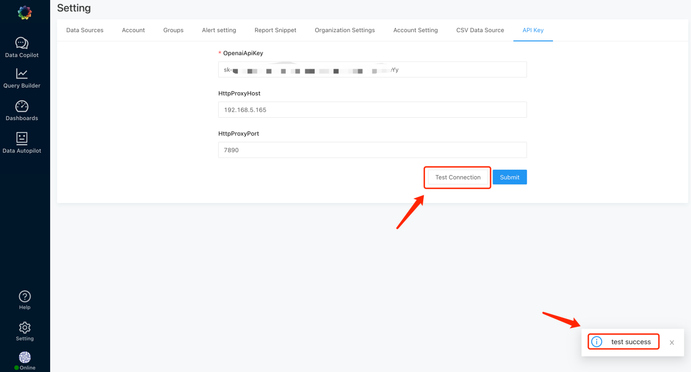

<h2 align="left">2,Configure Data Source</h2>

- Currently supported data sources are MySql, Doris, starRocks, PostgreSql, and CSV. More data sources will be supported
  in the future, such as sqlserver, clickhouse, SQLite, etc., so stay tuned.

### 2.1, CSV data source configure:

- [Setting]-[CSV Data Source]-[Click to upload]-select the csv file to be uploaded

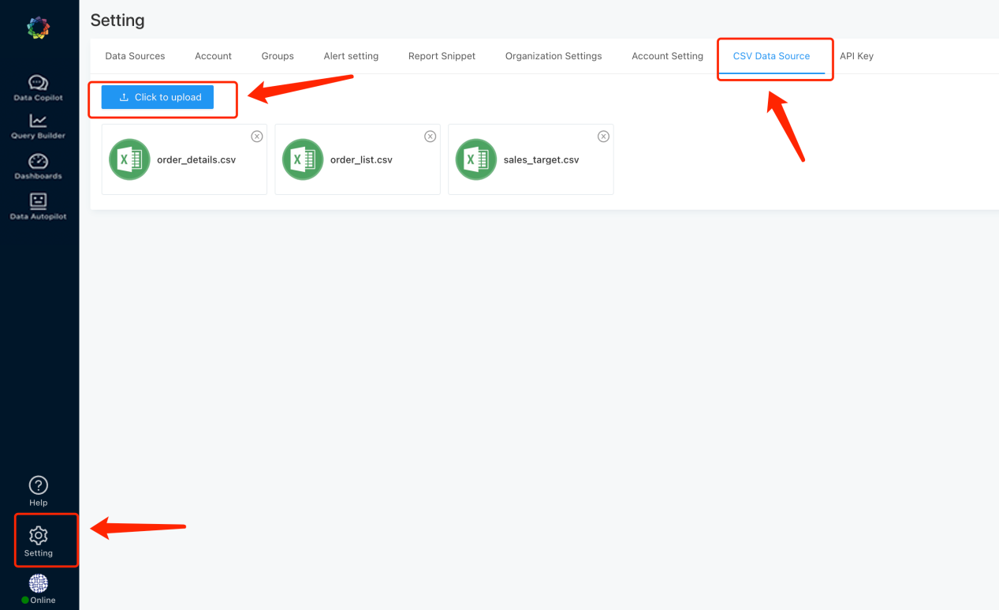

### 2.2, [MySql, Doris, starRocks, PostgreSql] data source configure:

- [Setting]-[Data Sources]-[New Data Source]
- Select the data source, fill in the database information, and save. After the configuration is completed,
  click [Test Connection ] and "Connection Success" will be displayed.

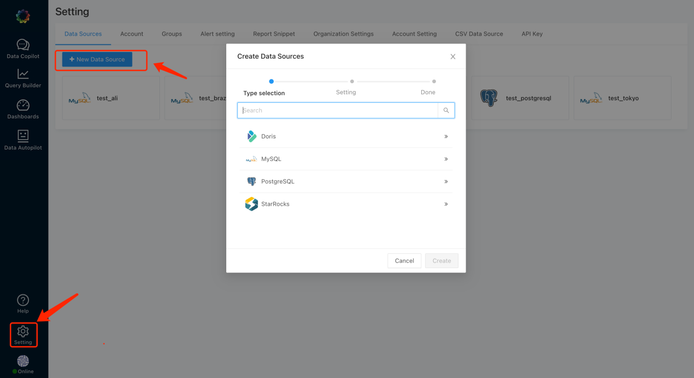

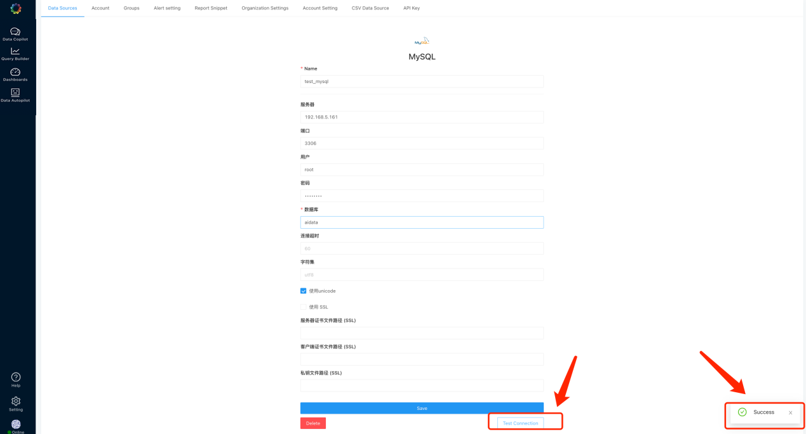

<h2 align="left">3,Chat Builder</h2>

<h3 align="left">3.1, [Chat Builder] - [Dialogue]</h3>

#### 3.1.1. Check the data (data source and table)

- The checked data will be used as the basic data for AI in conversation data analysis.

#### 3.1.2, fill in the comments and submit for AI detection

- Try to improve the form and field annotations as much as possible to help AI better understand the data and enable the
  Agent to better complete the data analysis task.

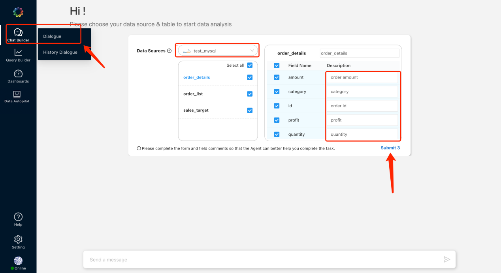

#### 3.1.3, modify the failed comments and submit again

- AI will feedback the comments that have not passed. Please revise and add them and submit again until all the comments
  pass.

#### 3.1.4, after all annotations pass the detection, start the conversation

- 🔥 Note: If you want to generate a persistent report, please use [Query Builder]-[Report Generation]. The reports that
  appear in [Chat Builder] are temporary reports and do not support persistence.

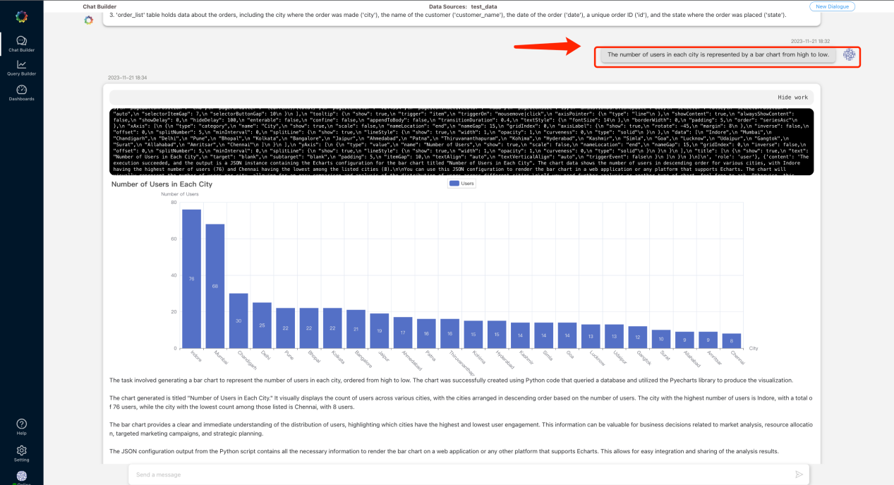

#### 3.1.5, reselect data source

- If you want to reselect the data source and start a new round of dialogue, please click [New Dialogue] to reset the
  current conversation. The current conversation record will be stored in [History Dialogue].

<h3 align="left">3.2, [Chat Builder] - [History Dialogue]</h3>
Can view historical conversation records

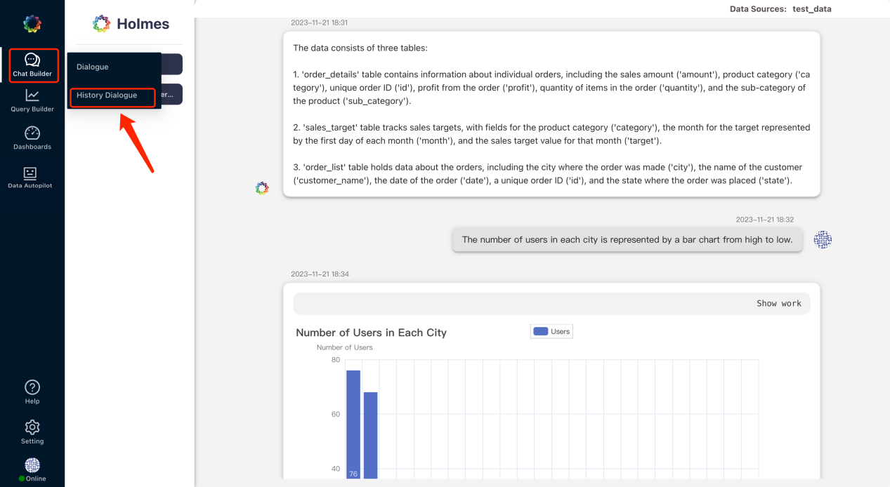

<h2 align="left">4, Query Builder </h2>

<h3 align="left">4.1, [Query Builder]-[Report Generation]</h3>

#### 4.1.1. Check the data (data source and table)

- The checked data will be used as the basic data of AI in report generation. 
- 🔥Note: Currently the CSV data source does
  not support [Report Generation]

#### 4.1.2, fill in the comments and submit for AI detection

- Try to improve the form and field annotations as much as possible to help AI better understand the data and enable the
  Agent to better complete the report generation task.

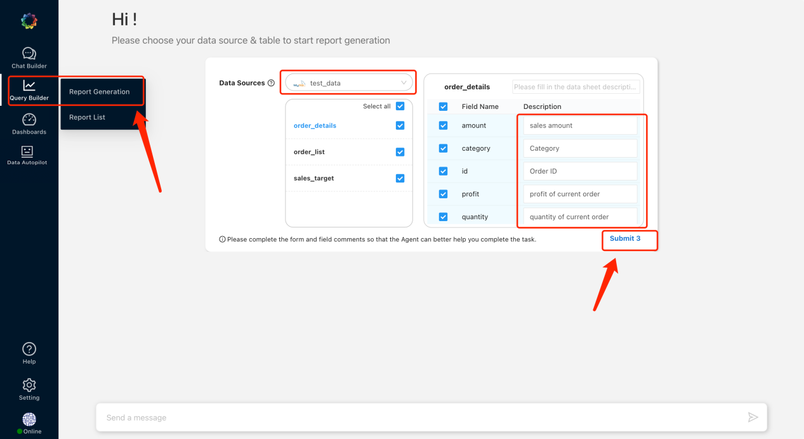

#### 4.1.3, modify the failed comments and submit again

- AI will feedback the annotations that have failed. Please revise and add them and submit again until all annotations
  pass the test.

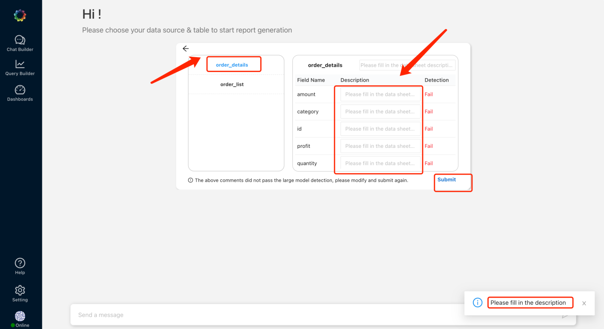

#### 4.1.4, after all annotations pass the detection, start the dialogue to generate reports

- Click [Edit Report] to directly edit the newly generated report.
- 🔥 Note: The [Report Generation] module currently only supports persistent report generation tasks. For analysis
  questions, please use [Chat Builder] - [Dialogue].

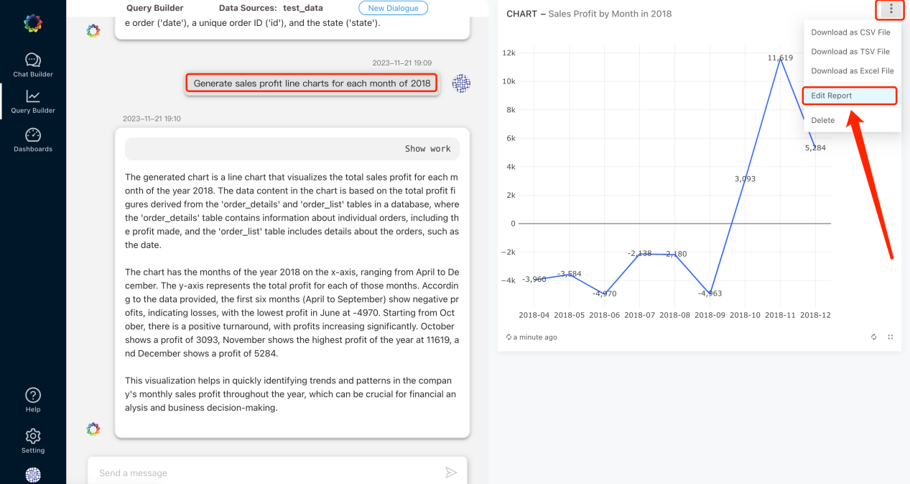

#### 4.1.5, reselect data source 

- If you want to reselect the data source and start a new round of dialogue, please click [New Dialogue] to reset the current dialogue.

<h3 align="left">4.2, [Query]-[Report List]</h3>

#### 4.2.1, Report status

- The newly generated report in [Report Generation] will appear in the [Report List]. At this time, the report is in
  draft status. If you want to display the report in the [Dashboards], please click the [Publish] button, change report
  status to published status.

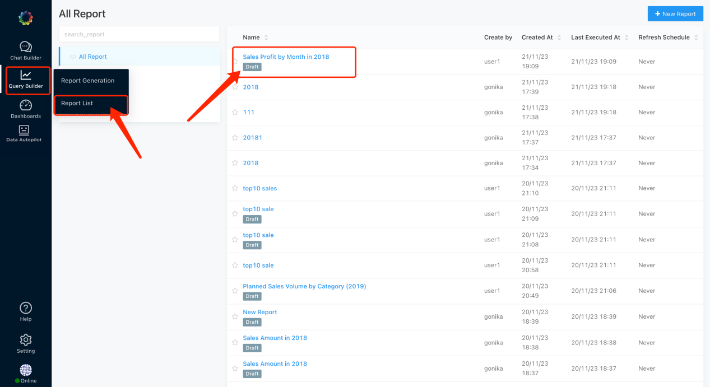

#### 4.2.2, Modify SQL statement

- Click [Edit Source] to customize the SQL statement of the report.

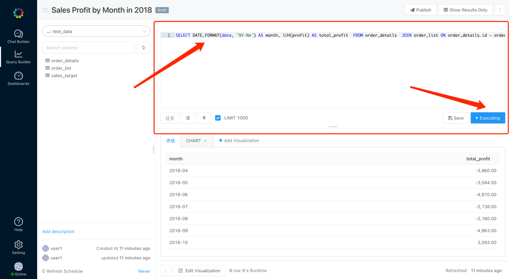

#### 4.2.3, modify chart style

- Click [Edit Visualization] to customize and edit the visualization chart style.
- Click [Add Visualization] to add a visual chart.

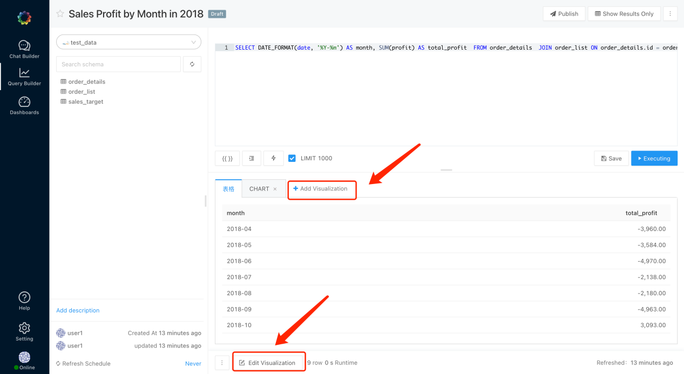

#### 4.2.4. Deleting a report

- Click [Archive] to change the report status to archive (delete) status.

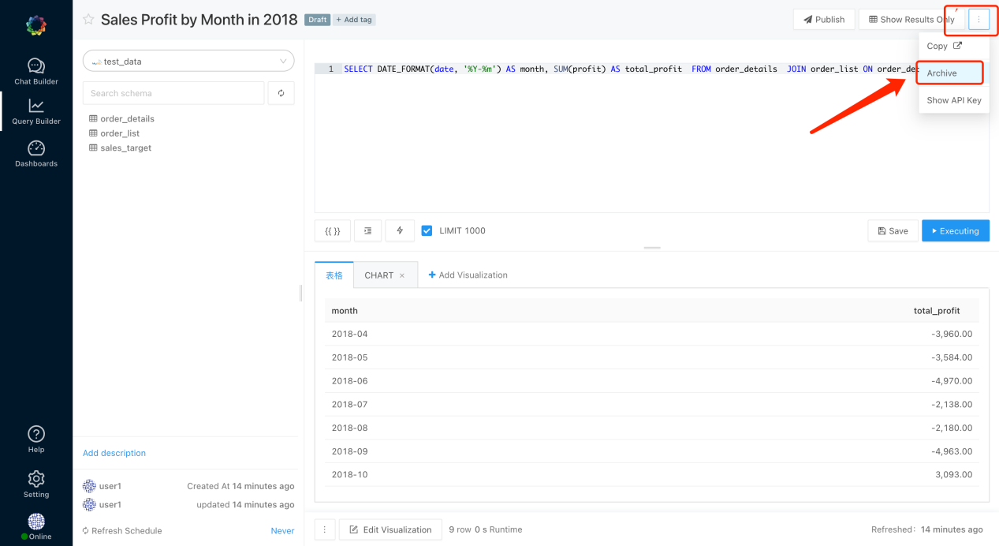

<h3 align="left">5, Dashboards</h3>

<h4 align="left">5.1, create a new dashboard</h4>

- [Dashboards]-[Create]-Edit Dashboard

- Add the newly generated Published report to the dashboard

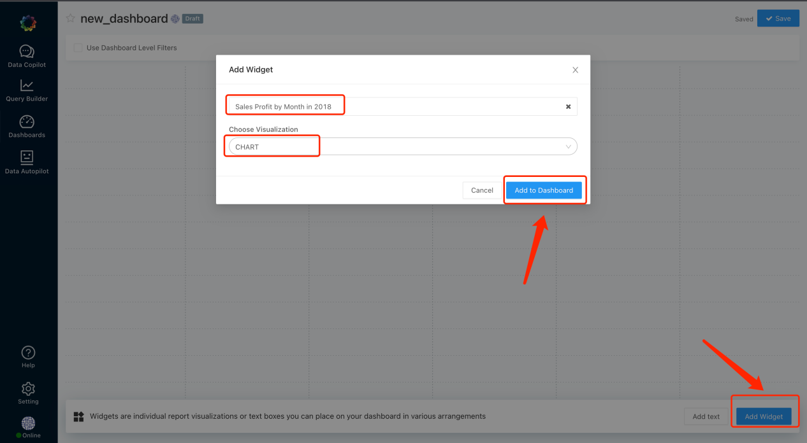

- Click [Publish] Dashboard

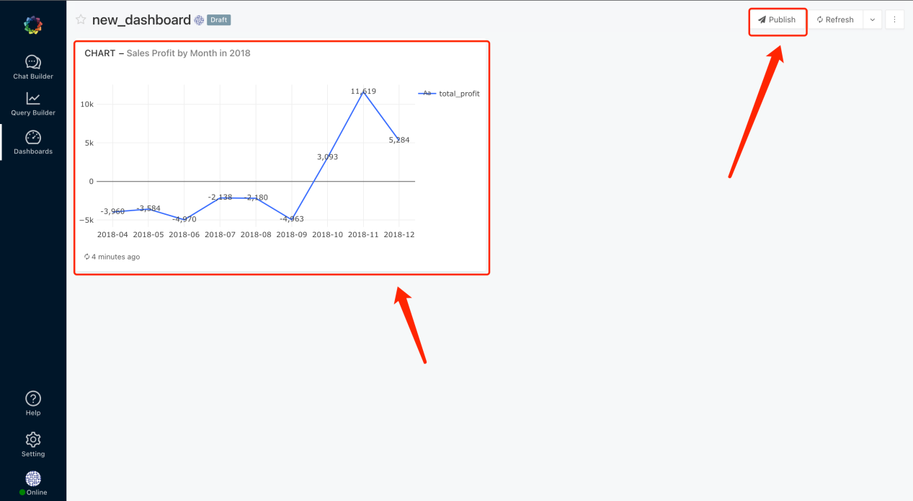

<h4 align="left">5.2 Share Dashboard </h4>

- After clicking [Publish], you can share the dashboard

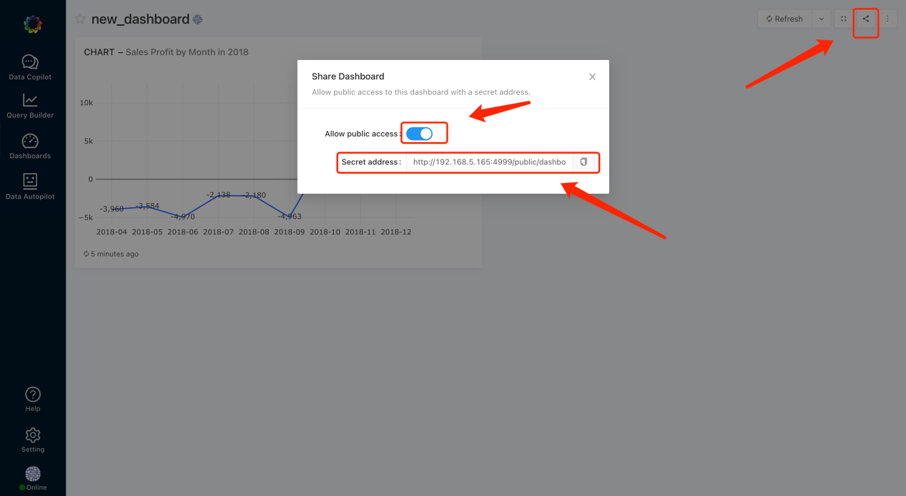

